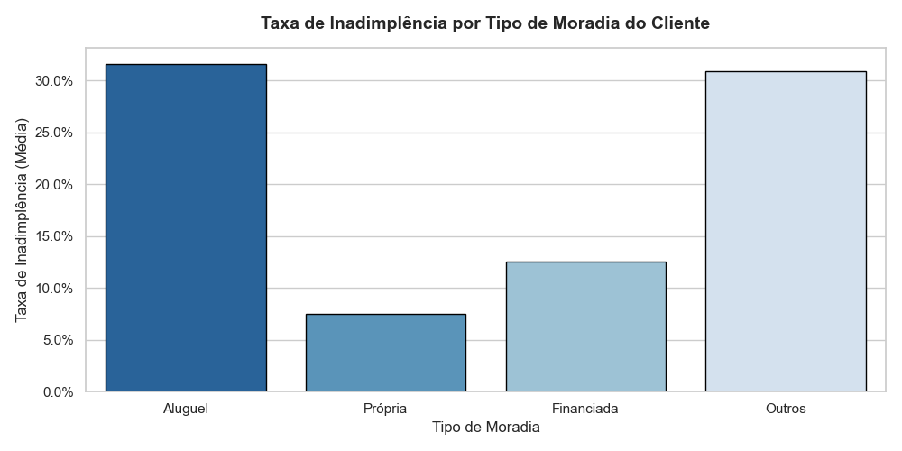

# Análise de Risco de Crédito: Minimizando Inadimplência com Python e MySQL

## 1. Contexto de Negócio
O controle de inadimplência é um dos maiores desafios de instituições financeiras e fintechs de crédito. Uma concessão de crédito ineficiente gera um aumento direto na Provisão para Devedores Duvidosos (PDD), impactando a rentabilidade líquida da operação. O objetivo deste projeto é analisar uma base histórica real de 32.500+ registros de empréstimos para identificar variáveis críticas de risco e propor políticas de crédito orientadas a dados.

## 2. Estrutura do Projeto e Tecnologias
* **Ingestão de Dados:** Carga rápida em blocos de arquivos CSV para banco de dados relacional via **Python (Pandas e SQLAlchemy)**.
* **Banco de Dados:** Armazenamento, modelagem e queries de agregação analítica utilizando **MySQL**.
* **Métricas Avaliadas:** Taxa de inadimplência por segmento ($T_i$), faixas etárias, perfis de moradia e intenção do empréstimo.

## 3. Principais Descobertas (Insights de Negócio)
Após a execução das queries de agregação analítica no MySQL sobre os 32.500 registros, mapeamos os seguintes indicadores críticos:
* **Inadimplência por Intenção:** Empréstimos solicitados para consolidar dívidas (*Debt Consolidation*) e para fins médicos (*Medical*) apresentam as maiores taxas de calote da carteira, superando os 25%.
* **O Fator Moradia:** Clientes que moram de aluguel (*Rent*) possuem uma taxa de inadimplência significativamente maior se comparada aos que possuem casa própria (*Own*).
* **Visão Demográfica:** A faixa etária jovem (18-24 anos) concentra a maior volatilidade de risco, com taxas de atraso superiores à média do público acima de 35 anos.

## 4. Próximos Passos
* [ ] Implementação de visualizações executivas (Dashboard) conectadas ao banco MySQL.
* [ ] Desenvolvimento de um modelo preditivo básico em Python para score de crédito.

